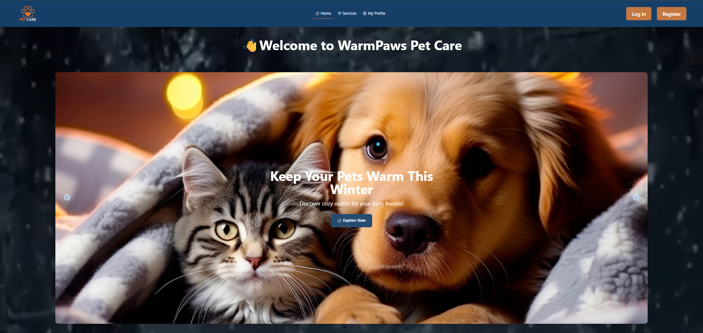

# 🐾 WarmPaws Pet Care

A modern and responsive pet-care web application where pet owners can explore services, manage appointments, and authenticate easily.  
Built with a clean UI, smooth UX, and powerful tools like React, Firebase, and TailwindCSS.

---

## 🌐 **Live Demo**
👉 **Live Project:** [https://your-live-link-here.com](https://pet-care-service-e83d1.web.app/) 

👉 **Repository:** https://github.com/mushfiq0000/warm-paws-pet-care-.git

---

## 📝 **Project Overview**
**WarmPaws Pet Care** is designed to help users find, explore, and book winter-special pet care services.  
The platform includes user authentication, password reset, service browsing, validation, and fully responsive UI for mobile & desktop.

---

## 🖼️ **Screenshot**



---

## 🚀 **Key Features**

### 🔐 **Authentication**
- Email/Password login  
- Google Login  
- Forgot Password (Google email reset)

### 🐶 **Service Management**
- View all pet care services  
- Search/filter services  
- Book appointments  

### ✔️ **Form Validation**
- Input length & validation checks  
- Error handling & UX improvements  

### 📱 **Responsive UI**
- Fully mobile-friendly layout  
- Optimized for all devices  

### 🎨 **UI/UX Enhancements**
- Carousels, alerts, notifications  
- Smooth marquee animations  

---

## 🛠️ **Tech Stack**

### **Frontend**
- React  
- React Router  
- TailwindCSS  
- DaisyUI  

### **Backend & Auth**
- Firebase Authentication  

### **UI/UX Tools**
- React Icons  
- Slick Carousel  
- React Slick  
- SweetAlert2  
- React Hot Toast  
- React Fast Marquee  

---

## 📦 **NPM Packages Used**

| Package | Purpose |
|--------|---------|
| **React** | UI development |
| **React Router** | Routing & navigation |
| **TailwindCSS** | Utility-first styling |
| **DaisyUI** | Pre-built Tailwind components |
| **Firebase** | Auth & backend services |
| **React Hot Toast** | Toast notifications |
| **SweetAlert2** | Beautiful popups |
| **React Icons** | Icon library |
| **Slick Carousel** | Slider/carousel |
| **React Slick** | Carousel wrapper |
| **React Fast Marquee** | Scrolling marquee |

---

## 🖥️ **How to Run Locally**

### 1️⃣ Clone the Repository
```sh
git clone https://github.com/mushfiq0000/warm-paws-pet-care-.git

cd warm-paws-pet-care-

npm install

src/firebase.config.js

npm start
